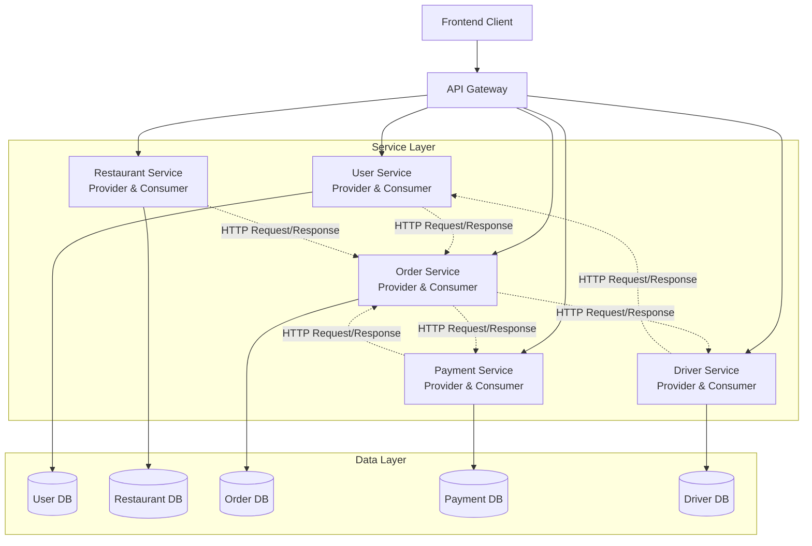
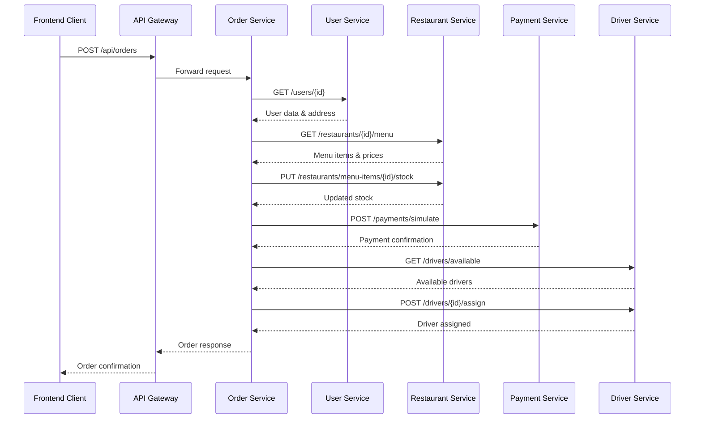

# Food Delivery System - UTS IAE/EAI

## 📋 Deskripsi Proyek

**Food Delivery System** adalah aplikasi berbasis **Service-Oriented Architecture (SOA)** yang mengimplementasikan sistem pemesanan makanan online dengan 5 microservices yang saling berkomunikasi melalui REST API. Sistem ini dibangun untuk memenuhi requirement UTS mata kuliah **IAE/EAI (Integration & Enterprise Application)**.

### Topik Pilihan
Proyek ini menggunakan topik **Food Delivery System** dimana layanan restoran, pelanggan, pesanan, pembayaran, dan driver saling terhubung menggunakan REST API untuk menyediakan layanan pemesanan makanan secara online.

### Fitur Utama
- ✅ **Multi-role System**: Customer, Driver, dan Admin
- ✅ **Restaurant Management**: CRUD restoran dan menu makanan
- ✅ **Order Management**: Pembuatan pesanan, tracking, dan status update
- ✅ **Payment Integration**: Simulasi pembayaran terintegrasi
- ✅ **Driver Management**: Manajemen driver dan gaji
- ✅ **Real-time Tracking**: Tracking pesanan dan driver
- ✅ **Dashboard Analytics**: Statistik penjualan dan dashboard admin

---

## 🏗️ Arsitektur Sistem

### Diagram Arsitektur Umum



### Contoh Alur Komunikasi: Food Delivery System



### Diagram Arsitektur (ASCII)

```
┌─────────────┐
│   Client    │ (Frontend React)
│  (Browser)  │
└──────┬──────┘
       │ HTTP/HTTPS
       ▼
┌─────────────────┐
│   API Gateway   │ (Port 3000)
│  (JWT Auth)     │
└──────┬──────────┘
       │
       ├──────────┬──────────┬──────────┬──────────┐
       │          │          │          │          │
       ▼          ▼          ▼          ▼          ▼
┌──────────┐ ┌──────────┐ ┌──────────┐ ┌──────────┐ ┌──────────┐
│   User   │ │Restaurant│ │  Order   │ │ Payment  │ │  Driver  │
│ Service  │ │ Service  │ │ Service  │ │ Service  │ │ Service  │
│  :3001   │ │  :3002   │ │  :3003   │ │  :3004   │ │  :3005   │
└────┬─────┘ └────┬─────┘ └────┬─────┘ └────┬─────┘ └────┬─────┘
     │            │             │             │             │
     ▼            ▼             ▼             ▼             ▼
┌──────────┐ ┌──────────┐ ┌──────────┐ ┌──────────┐ ┌──────────┐
│   MySQL  │ │   MySQL  │ │   MySQL  │ │   MySQL  │ │   MySQL  │
│  :3307   │ │  :3308   │ │  :3309   │ │  :3310   │ │  :3311   │
└──────────┘ └──────────┘ └──────────┘ └──────────┘ └──────────┘
```

### Arsitektur: Client → API Gateway → Services → DB

1. **Client (Frontend)**
   - React-based web application
   - Port: `80` (Docker) / `5173` (Development)
   - Mengakses semua services melalui API Gateway

2. **API Gateway**
   - Single entry point untuk semua requests
   - Port: `3000`
   - JWT Authentication & Authorization
   - Request routing ke microservices

3. **Microservices** (5 Services)
   - **User Service** (Port 3001): Manajemen user, auth, addresses
   - **Restaurant Service** (Port 3002): Manajemen restoran & menu
   - **Order Service** (Port 3003): Manajemen pesanan
   - **Payment Service** (Port 3004): Simulasi pembayaran
   - **Driver Service** (Port 3005): Manajemen driver & gaji

4. **Database Layer**
   - 5 MySQL databases terpisah (one database per service)
   - Port: `3307-3311` (Docker) / `3306` (Local)

### Service Communication (SOA)

Services saling berkomunikasi melalui HTTP API calls:

- **Order Service** → User Service (validasi user, get address)
- **Order Service** → Restaurant Service (validasi menu, check stock)
- **Order Service** → Payment Service (create payment)
- **Order Service** → Driver Service (assign driver)
- **Payment Service** → Order Service (payment callback)
- **Driver Service** → User Service (get user data)
- **Driver Service** → Order Service (get active orders)

---

## 🚀 Cara Menjalankan

### Prerequisites

- **Docker & Docker Compose** (Recommended)
- **Node.js 18+** (untuk development tanpa Docker)
- **MySQL 8.0+** (jika tidak menggunakan Docker)
- **npm** atau **yarn**

### Opsi 1: Docker Compose (Recommended)

#### 1. Clone & Navigate
```bash
cd food-delivery-project
```

#### 2. Start All Services
```bash
docker-compose up --build
```

#### 3. Access Application
- **Frontend**: http://localhost:80
- **API Gateway**: http://localhost:3000
- **Health Check**: http://localhost:3000/health

#### 4. Swagger Documentation
- User Service: http://localhost:3001/api-docs
- Restaurant Service: http://localhost:3002/api-docs
- Order Service: http://localhost:3003/api-docs
- Payment Service: http://localhost:3004/api-docs
- Driver Service: http://localhost:3005/api-docs

### Opsi 2: Manual Start (Tanpa Docker)

#### Urutan Start Services

**PENTING**: Start services sesuai urutan berikut untuk memastikan dependencies tersedia:

1. **Start Databases** (MySQL)
   ```bash
   # Pastikan MySQL berjalan di port 3306
   # Buat 5 database:
   # - user_service_db
   # - restaurant_service_db
   # - order_service_db
   # - payment_service_db
   # - driver_service_db
   ```

2. **Start User Service** (Port 3001)
   ```bash
   cd 2-services/01-user-service
   npm install
   npm run dev
   ```

3. **Start Restaurant Service** (Port 3002)
   ```bash
   cd 2-services/02-restaurant-service
   npm install
   npm run dev
   ```

4. **Start Payment Service** (Port 3004)
   ```bash
   cd 2-services/04-payment-service
   npm install
   npm run dev
   ```

5. **Start Driver Service** (Port 3005)
   ```bash
   cd 2-services/05-driver-service
   npm install
   npm run dev
   ```

6. **Start Order Service** (Port 3003)
   ```bash
   cd 2-services/03-order-service
   npm install
   npm run dev
   ```

7. **Start API Gateway** (Port 3000)
   ```bash
   cd 1-api-gateway
   npm install
   npm run dev
   ```

8. **Start Frontend** (Port 5173)
   ```bash
   cd 3-frontend
   npm install
   npm run dev
   ```

#### Helper Scripts

Gunakan script helper untuk start/stop semua services:

```bash
# Start all services
./docs/scripts/start-all.sh

# Stop all services
./docs/scripts/stop-all.sh

# Migrate fresh (clean & reinitialize databases)
./docs/scripts/migrate-fresh.sh
```

---

## ⚙️ Environment Variables

### API Gateway (`1-api-gateway/.env`)

```env
PORT=3000
JWT_SECRET=your-super-secret-jwt-key-change-in-production
JWT_EXPIRES_IN=24h
USER_SERVICE_URL=http://localhost:3001
RESTAURANT_SERVICE_URL=http://localhost:3002
ORDER_SERVICE_URL=http://localhost:3003
PAYMENT_SERVICE_URL=http://localhost:3004
DRIVER_SERVICE_URL=http://localhost:3005
```

### User Service (`2-services/01-user-service/.env`)

```env
PORT=3001
DB_HOST=localhost
DB_PORT=3308
DB_USER=root
DB_PASSWORD=your_password
DB_NAME=user_service_db
JWT_SECRET=your-super-secret-jwt-key-change-in-production
JWT_EXPIRES_IN=24h
```

### Restaurant Service (`2-services/02-restaurant-service/.env`)

```env
PORT=3002
DB_HOST=localhost
DB_PORT=3308
DB_USER=root
DB_PASSWORD=your_password
DB_NAME=restaurant_service_db
```

### Order Service (`2-services/03-order-service/.env`)

```env
PORT=3003
DB_HOST=localhost
DB_PORT=3308
DB_USER=root
DB_PASSWORD=your_password
DB_NAME=order_service_db
USER_SERVICE_URL=http://localhost:3001
RESTAURANT_SERVICE_URL=http://localhost:3002
PAYMENT_SERVICE_URL=http://localhost:3004
DRIVER_SERVICE_URL=http://localhost:3005
```

### Payment Service (`2-services/04-payment-service/.env`)

```env
PORT=3004
DB_HOST=localhost
DB_PORT=3308
DB_USER=root
DB_PASSWORD=your_password
DB_NAME=payment_service_db
ORDER_SERVICE_URL=http://localhost:3003
```

### Driver Service (`2-services/05-driver-service/.env`)

```env
PORT=3005
DB_HOST=localhost
DB_PORT=3308
DB_USER=root
DB_PASSWORD=your_password
DB_NAME=driver_service_db
USER_SERVICE_URL=http://localhost:3001
ORDER_SERVICE_URL=http://localhost:3003
```

### Frontend (`3-frontend/.env`)

```env
VITE_API_BASE_URL=http://localhost:3000/api
```

---

## 👥 Anggota & Peran

| NIM | Nama | Peran & Tanggung Jawab |
|-----|------|------------------------|
| **102022330145** | **Muhammad Rayhan Ramadhan** | **Lead Developer & Full Stack**<br/>- API Gateway & Architecture Design<br/>- User Service (Auth, Profile, Addresses)<br/>- Order Service (Core Logic, SOA Integration)<br/>- Frontend Development (React, UI/UX)<br/>- Database Design & Migration<br/>- Documentation & Testing |
| 102022300174 | Adinar Tri Panuntun | **Backend Developer**<br/>- Restaurant Service (CRUD, Menu Management)<br/>- Payment Service (Payment Processing)<br/>- API Integration & Testing |
| 102022300416 | Jehezkiel Agna Saputra | **Backend Developer**<br/>- Driver Service (Driver Management, Salaries)<br/>- Order Service (Driver Integration)<br/>- Database Optimization |
| 102022300289 | Muhammad Caesar Rivaldo | **Frontend Developer**<br/>- Frontend Components (Customer, Driver Views)<br/>- UI/UX Design<br/>- API Integration Testing |

### Mapping Anggota ↔️ Service/Fitur

#### Muhammad Rayhan Ramadhan (Lead)
- ✅ **API Gateway**: Design, routing, JWT auth
- ✅ **User Service**: Complete implementation
- ✅ **Order Service**: Core business logic, SOA communication
- ✅ **Frontend**: Main dashboard, admin panel, customer flow
- ✅ **Database**: Schema design, migration scripts
- ✅ **Documentation**: README, API docs, Postman collection

#### Adinar Tri Panuntun
- ✅ **Restaurant Service**: CRUD operations, menu management
- ✅ **Payment Service**: Payment simulation, order integration
- ✅ **API Testing**: Postman testing, Swagger documentation

#### Jehezkiel Agna Saputra
- ✅ **Driver Service**: Driver management, salary system
- ✅ **Order-Driver Integration**: Driver assignment, order tracking
- ✅ **Database**: Driver service database optimization

#### Muhammad Caesar Rivaldo
- ✅ **Frontend Components**: Customer dashboard, driver dashboard
- ✅ **UI/UX**: Design implementation, responsive layout
- ✅ **Frontend Testing**: Component testing, integration testing

---

## 📡 Ringkasan Endpoint

### API Gateway
- **Base URL**: `http://localhost:3000/api`
- **Health Check**: `GET /health`

### User Service
- **Auth**: `POST /api/users/auth/register`, `POST /api/users/auth/login`
- **Profile**: `GET /api/users/profile`
- **Addresses**: `GET|POST|PUT|DELETE /api/users/addresses`
- **Admin**: `GET /api/users/admin/all`

### Restaurant Service
- **Public**: `GET /api/restaurants`, `GET /api/restaurants/:id/menu`
- **Admin**: `POST|PUT|DELETE /api/restaurants`, `POST|PUT|DELETE /api/restaurants/menu-items/:id`

### Order Service
- **Customer**: `POST|GET /api/orders`, `GET /api/orders/:id`
- **Driver**: `GET /api/orders/available`, `POST /api/orders/:id/accept`, `POST /api/orders/:id/complete`
- **Admin**: `GET /api/orders/admin/all`, `GET /api/orders/admin/dashboard/stats`

### Payment Service
- **Customer**: `POST /api/payments/simulate`

### Driver Service
- **Driver**: `GET|PUT /api/drivers/profile`
- **Admin**: `GET /api/drivers/admin/all`, `GET|POST /api/drivers/admin/salaries`

### Dokumentasi Lengkap

Untuk dokumentasi API lengkap, lihat:
- **Swagger UI**: Setiap service memiliki Swagger docs di `/api-docs`
- **Postman Collection**: `docs/postman/postman-collection.json`
- **Postman Guide**: `docs/postman/POSTMAN_README.md`
- **API Documentation**: `docs/api/` (jika tersedia)
- **Full Documentation**: `docs/README.md`

---

## 🛠️ Teknologi yang Digunakan

### Backend
- **Node.js** + **TypeScript**
- **Express.js** (Web Framework)
- **MySQL** (Database)
- **JWT** (Authentication)
- **Swagger/OpenAPI** (API Documentation)

### Frontend
- **React** + **TypeScript**
- **Vite** (Build Tool)
- **Tailwind CSS** (Styling)
- **Framer Motion** (Animations)
- **React Router** (Routing)

### DevOps
- **Docker** & **Docker Compose**
- **Nginx** (Reverse Proxy untuk Frontend)

---

## 📚 Dokumentasi

Semua dokumentasi tersedia di folder `docs/`:

- **Setup Guide**: `docs/SETUP.md`
- **Run Guide**: `docs/RUN_GUIDE.md`
- **Docker Guide**: `docs/DOCKER_GUIDE.md`
- **API Testing**: `docs/API_TESTING.md`
- **Postman Collection**: `docs/postman/postman-collection.json`
- **Postman Guide**: `docs/postman/POSTMAN_README.md`
- **Database Migration**: `docs/MIGRATE_ALL.md`
- **Documentation Index**: `docs/README.md`

---

## 🧪 Testing

### Postman Collection
Import collection dari `docs/postman/postman-collection.json` ke Postman untuk testing semua endpoints.

### Swagger UI
Akses Swagger UI di setiap service untuk interactive API testing:
- User Service: http://localhost:3001/api-docs
- Restaurant Service: http://localhost:3002/api-docs
- Order Service: http://localhost:3003/api-docs
- Payment Service: http://localhost:3004/api-docs
- Driver Service: http://localhost:3005/api-docs

---

## 📝 License

Proyek ini dibuat untuk keperluan akademik (UTS IAE/EAI).

---

## 👨‍💻 Kontributor

- **Muhammad Rayhan Ramadhan** (102022330145) - Lead Developer
- **Adinar Tri Panuntun** (102022300174) - Backend Developer
- **Jehezkiel Agna Saputra** (102022300416) - Backend Developer
- **Muhammad Caesar Rivaldo** (102022300289) - Frontend Developer

---

**Dibuat untuk UTS IAE/EAI - Food Delivery System**
